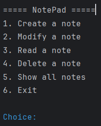
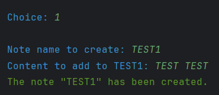
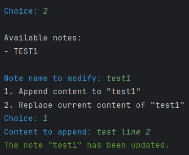
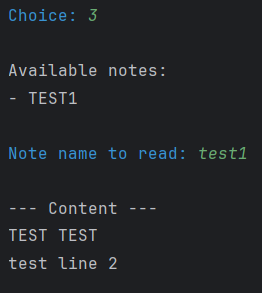
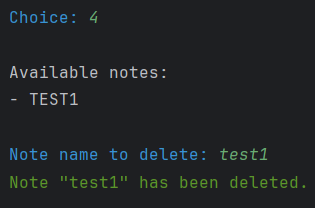
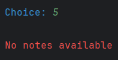

# Kotlin NotePad CLI

**Kotlin NotePad CLI** is a simple note-taking application built in Kotlin.  
It runs in the command line and allows users to create, read, update, modify, and delete notes easily.  
The project uses basic file management to store notes locally and provides an interactive text-based menu for navigation.

---

## Features
- Create new notes
- Read existing notes
- Modify notes (append or replace content)
- Delete notes
- List all available notes

---

##  How It Works
This is a console-based Kotlin application.  
Notes are stored locally as text files, and users interact with the program through a simple menu in the terminal.

---

## Live Demo
You can run the project directly in **GitHub Codespaces**:
1. Open this repository in GitHub.
2. Click **Code → Codespaces → Create codespace on main**.
3. Compile and run the app in the built-in terminal:
   ```bash
   kotlinc Main.kt -include-runtime -d app.jar
   java -jar app.jar

## Screenshots

### Main Menu


### Creating a Note


### Modifying a Note


### Reading a Note


### Deleting a Note


### Showing all notes


## Repository Structure
Main.kt → Source code
README.md → Documentation
screenshots/ → Screenshots and demo GIF

## Made With
Kotlin
GitHub Codespaces
Git version control